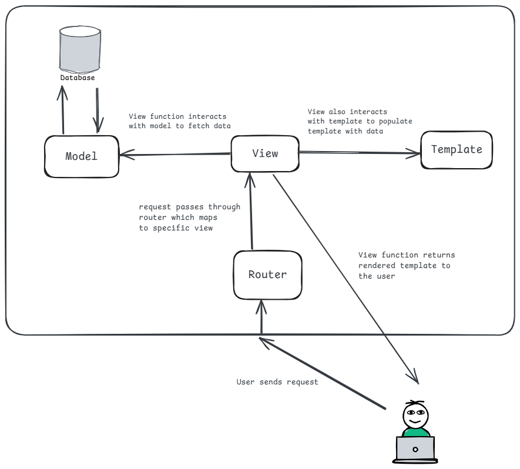

# Model View Template Architecture

In traditional web applications, a web application is a continuously running server machine which waits for HTTP request from web clients (mostly web browsers). When a user types in the URL and sends the request to the server, the server processes the request and sends back the response to the client. Depending on the path of the request, the server can return different content to the client. To create the response for the request, the server may also need to fetch data from a database. It may need to perform different operations including business logic before sending full response to the client.

There are various software architecture patterns to make code more manageable and testable.
- MVC (Model View Controller) architecture
- MVVM (Model View ViewModel) architecture
- MVT (Model View Template) architecture

## Understanding MVT Architecture

Django follows model view template architecture. Basically, Django applications group the code that processes the request and into separate files. 

1. The model is the data structure that Django uses to store and retrieve data from the database. It is a Python class that defines the structure of the data that is stored in the database. It also provides various methods to interact with the database.
2. The view is the code that processes the request and returns the response to the client. It is a Python function that takes the request and returns the response. The response can be simple text response, HTML response or a JSON response. The view can also interact with template which can be a template of HTML document to return to the client. The view will interact with model and populate the template with the data from the model.
3. The template is the HTML file that is used to render the response to the client. It is a file that contains the HTML code that is used to display the data in the view. The data can be retrieved from backend database by the view function and handed over to the template to create dynamic response.

There is yet another part which is missing. Different URLs need to send different responses. This is handled by the router which maps the URL to the view function. Each view function is responsible for a specific URL. The router is usually defined as part of the `urls.py` file in Django. You will see this in upcoming tutorial.
