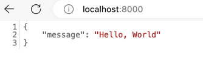

# FastAPI First Example

Now, that you've your environment setup, it's time to create our first FastAPI application.

Create a new file called `main.py` and add the following code:

```python
from fastapi import FastAPI

app = FastAPI()

@app.get("/")
def home():
    return {"message": "Hello, World"}
```

This code creates a FastAPI application with a single route `/` that returns a JSON response `{"Hello": "World"}`.

Now, make sure your virtual environment is activated and run the application, execute the following command on the terminal.

```bash
uvicorn main:app --reload
```

This will start up a development server on `http://localhost:8000`. Visit this URL in your browser, and you should see the JSON response.



Let's understand this code a little bit before moving forward.

First, we import the `FastAPI` class from the `fastapi` module. Then, we create an instance of the `FastAPI` class and store it in the variable `app`.

Next, we define a route using the `@app.get` decorator. The `@app.get` decorator is used to define a route that responds to HTTP GET requests. The route we define is `/`, which is the root URL of the application. This can be accessed at the URL `http://localhost:8000/` when we run the server locally. So, basically `@app.get` decorator is used to map a Python function to specific route.

The `home` function is the route handler function for the route. It returns a dictionary with a single key-value pair `{"message": "Hello, World"}`. This dictionary will be converted to JSON format and sent as the response when this route is accessed on the web browser.

When you execute the command `uvicorn main:app --reload`, the `main` is the server file where the `FastAPI` instance is created and the `app` is the instance variable name. Try changing those to other names and run the server again. You will see an error message.

```python
from fastapi import FastAPI

application = FastAPI()


@application.get("/")
def home():
    return {"message": "Hello, World"}
```

In order to get above application running, you need to run the following command.

```bash
uvicorn main:application --reload
```

The `--reload` flag is used to automatically reload the server when the source code changes.

As a last step, try changing the message in the response from `Hello, World` to something else and see the changes reflect in the browser.

