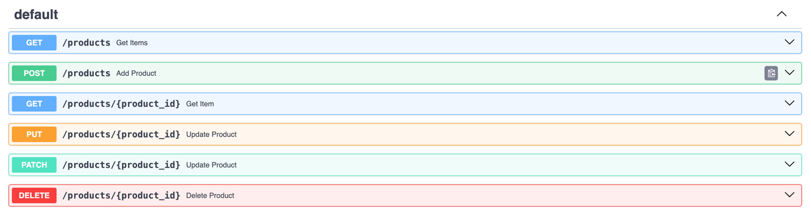

# Handling POST Request

In this tutorial, we will learn how to handle POST requests in FastAPI. We will create a simple API that accepts a POST request with a JSON payload. We will use Pydantic's `BaseModel` to define the request body schema and return a response with different classes.

## Implementing Full CRUD API

Create a new Python file called `main.py` and add the following code:

```python
from fastapi import FastAPI, Body

app = FastAPI()


products = [
    {"id": 1, "name": "iPhone", "price": 999.99, "brand": "Apple", "category": "Phones", "description": "The iPhone is a smartphone made by Apple Inc."},
    {"id": 2, "name": "Galaxy", "price": 899.99, "brand": "Samsung", "category": "Phones", "description": "The Galaxy is a smartphone made by Samsung."},
    {"id": 3, "name": "Pixel", "price": 799.49, "brand": "Google", "category": "Phones", "description": "The Pixel is a smartphone made by Google."}
]


@app.get("/products")
async def get_items():
    return products

@app.get("/products/{product_id}")
async def get_item(product_id: int):
    for product in products:
        if product["id"] == product_id:
            return product
```

## Creating a new Product `POST` Method

One of the interesting aspect of `POST` HTTP method is that those request information is not visible in the URL. Instead, it is sent in the body of the request. This is useful when you want to send a large amount of data to the server. This also means we need a away to handle request body in FastAPI.

The data needed to create new item is sent in the body of the request. Web browsers do not support sending POST requests without Javascript. We will have to use either Swagger UI or a tool like Postman to send `POST` requests to our FastAPI application.

Add below path function in the `main.py` application code.

```python
@app.post("/products")
async def add_product(name: str = Body(), price: float = Body(), brand: str = Body(), category: str = Body(), description: str = Body()):
    product = {"id": len(products) + 1, "name": name, "price": price, "brand": brand, "category": category, "description": description}
    products.append(product)
    return product
```

`POST` requests are handled using `@app.post()` decorator in FastAPI. It includes the request body data. Each of the parameters of the body data is passed to corresponding `Body` parameter declared in the path function. In this case, the `product` is created from all the parameters and added to the `products` list. Finally, the function returns the newly added `product` back to the client.

Also, in this case, the `id` of the product is determined by the number of products we have. So, `id` is set to `len(products) + 1`.

Run the FastAPI application using Uvicorn:

```bash
uvicorn main:app --reload
```

Now, in order to test product creation, let's test out with Swagger UI. With this run, you can try getting all products and you will see three products returned.
Next, let's try to add new product into the list of products.

1. Go to `http://localhost:8000/docs` to open Swagger UI.
2. Click on the `/products` endpoint with `POST` method.
3. Click on the `Try it out` button.
4. Fill in the Response body with the following JSON data:

```json
{
  "name": "OnePlus",
  "price": 699.99,
  "brand": "OnePlus",
  "category": "Phones",
  "description": "The OnePlus is a smartphone made by OnePlus."
}
```
 
5. Click on the `Execute` button.
You should get `200` response code with the newly added product in the response body.
6. Go to the `/products` endpoint with `GET` method to see the newly added product in the list of products.

## Updating a Product - `PUT` Method

HTTP `PUT` method is used to perform full update of a product. This HTTP method is used to perform complete replacement of a product such that all fields are updated. This is handled using conveniently named method `@app.put()`.

```python
@app.put("/products/{product_id}")
async def update_product(product_id: int, name: str = Body(), price: float = Body(), brand: str = Body(),
                            category: str = Body(), description: str = Body()):
        for product in products:
            if product["id"] == product_id:
                product["name"] = name
                product["price"] = price
                product["brand"] = brand
                product["category"] = category
                product["description"] = description
                return product
```

Notice that in this case, the request needs all the parameters and we cannot skip any of the required fields in the body of the request.


## Partial Update of Product - `PATCH` Method

HTTP `PATCH` method is used to make partial updates to a product. That is changing one of the fields of the product. This is handled using `@app.patch()` method in FastAPI. Again the information is sent via request body in this method.

```python
@app.patch("/products/{product_id}")
async def update_product(product_id: int, name: str = Body(None), price: float = Body(None), brand: str = Body(None),
                            category: str = Body(None), description: str = Body(None)):
        for product in products:
            if product["id"] == product_id:
                product["name"] = name if name else product["name"]
                product["price"] = price if price else product["price"]
                product["brand"] = brand if brand else product["brand"]
                product["category"] = category if category else product["category"]
                product["description"] = description if description else product["description"]
                return product
```

Notice that in this case, the path function parameters are passed as `Body(None)` so they do not need to be present in all requests. They are like of optional using this syntax `price: float = Body(None)`. 

Also the logic for updating each field checks if we have the corresponding parameter in the request, if not, use existing `product` information else use the new parameter value from the request.

```python
product["name"] = name if name else product["name"]
```

## Deleting a Product - `DELETE` Method

In this tutorial, you implemented a simple CRUD endpoints using FastAPI `Body` parameters. You used simple `Body` parameters to handle the request body. In the upcoming tutorials, you will learn how to use Pydantic's `BaseModel` to handle request body and response data more easily with validations.

```python
@app.delete("/products/{product_id}")
async def delete_product(product_id: int):
    for product in products:
        if product["id"] == product_id:
            products.remove(product)
            return product
    return {"message": "Product not found"}
```

After adding all these methods, you should see all API endpoints in Swagger UI like below image.



## Testing all Endpoints

1. First verify `/products` return three products from the code.
2. Let's modify the product with `id=2`. 
3. Execute `PATCH` request with below payload by entering `product_id` as `2`.

```json
{
  "name": "Moto Razor",
  "brand": "Motorola",
  "description": "This is Motorola Razor phone"
}
```

4. Make sure the product has been updated by invoking `GET` request on `products/2` endpoint. Verify the `price` has not changed.
5. Next, let's add new product by executing `POST` endpoint with below payload.

```json
{
  "name": "OnePlus",
  "price": 699.99,
  "brand": "OnePlus",
  "category": "Phones",
  "description": "The OnePlus is a smartphone made by OnePlus."
}
```

6. Verify you now have four products by executing `GET` endpoint on `/products`.
7. Now, test `PUT` method which should update complete product. First let's verify that we need all fields by entering below JSON payload and trying to execute it against `/products/{product_id}` endpoint with `id=2`. 

```json
{
  "name": "Motorola",
  "price": 599.99
}
```

8. Next, try to add all the required fields to make sure `PUT` request works with below JSON.

```json
{
  "name": "Moto Razor",
  "price": 599.99,
  "brand": "Motorola",
  "category": "Phones",
  "description": "Hello Moto, Motorola Razor"
}
```

9. Now, retrieve the product with `product_id=2` and check it's response JSON object. It should have new description and price.
10. Next, let's delete this product with `product_id=2` by invoking `DELETE` request on `products/{product_id}` endpoint.
11. Try getting all products and see that now you get only 3 products if you've not restarted the server or make sure `product_id=2` is not in the result set.