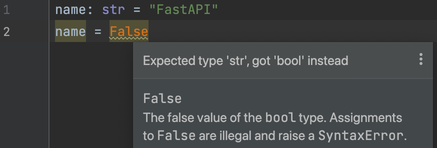

# Python New Features

This lesson talks about new features that were introduced in Python 3.5 and later. 

## Type Hints

Newer versions of Python comes with type hints to declare the type of variables, function arguments and return types. This is not enforced by the Python interpreter but can be used by static type checkers like [mypy](https://pypi.org/project/mypy/. A type hint can be nice tool for development as it can remind you about to correct types and will try to avoid runtime errors which are caused by wrong types. For example, if you declare a variable as `str` and try to assign a `int` or `bool` to it, mypy will give you an error.



Python 3.9+ introduced type annotations for lists and dictionaries. You can use `dict[str, int]` to declare a dictionary with string keys and integer values.

FastAPI uses Pydantic for data validation and serialization. Pydantic uses type hints to declare the types of variables. This is a very powerful feature of FastAPI. It also helps with the documentation of the API. FastAPI comes with a built-in feature to generate OpenAPI documentation for your API. You don't have to write any new code in order to create those API docs. FastAPI will automatically generate the API docs based on the type hints you provide in your code.


## Coroutines with async and await

Python 3.5 introduced `async` and `await` keywords to define coroutines. A coroutine is a function that can pause and resume its execution. You can use `await` keyword to pause the execution of a coroutine until the result is ready. This is very useful when you are working with I/O bound operations like reading from a file, making a network request, etc.

These asynchronous operations come from the `asyncio` module. You can use `asyncio.run()` to run the main coroutine. This module is the foundation for Python's ASGI (Asynchronous Server Gateway Interface) servers like FastAPI and Starlette.

In async application, the processing logic is structured in coroutines instead of traditional functions. A coroutine is similar to a function in Python, but can be paused and resumed. It's defined with `async` keyword as a prefix. 

```python
import asyncio

async def wait():
    print("waiting...")
    return

print('hello')
asyncio.run(wait())
print('world')
```