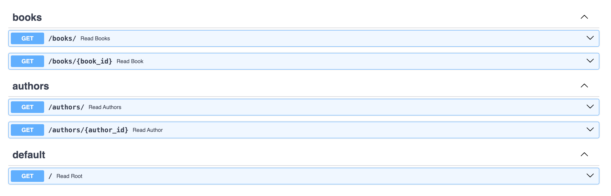

# Handling Multiple Routes using APIRouter

So far, our examples have been using only a handful of routes. However, what if you have thousands of routes to handle? Adding all of those routes in the single file might be very difficult to manage, this is where `APIRouter` comes in. In FastAPI, you can use `APIRouter` to group routes and include them in the main file. You can use the `prefix` parameter to add a prefix to all routes in the router. This will make more sense as you read through this tutorial.

## What is APIRouter?

`APIRouter` is a class provided by FastAPI that helps you to organize your routes in a better way. You can create an instance of `APIRouter` and define routes using the familar `@router.get`, `@router.post`, `@router.put`, `@router.delete` decorators. This way you can add routes related to `/books` in separate module and the include them in the main file. Similarly, you can create new endpoints for `/authors` in a separate module and include them in the main file. 

## Using APIRouter

Let's create a simple `books.py` module in your project directory and add the following code.

```python
from fastapi import APIRouter

router = APIRouter()

books = [
    {"book_id": 1, "title": "The Great Gatsby", "author": "F. Scott Fitzgerald"},
    {"book_id": 2, "title": "Crime and Punishment", "author": "Fyodor Dostoevsky"},
    {"book_id": 3, "title": "The Lord of the Rings", "author": "J.R.R. Tolkien"},
    {"book_id": 4, "title": "To Kill a Mockingbird", "author": "Harper Lee"},
]

@router.get("/")
async def read_books():
    return books

@router.get("/{book_id}")
async def read_book(book_id: int):
    return books[book_id - 1]
```

In this case, I have hard coded the available books as `books` array, but those can also come from a backend store. The `read_books` function returns all the books available in the store, while the `read_book` function returns a single book based on the `book_id` provided in the URL. Notice that the endpoints are defined using the `@router.get` decorator instead of `@app.get` and the `router` is an instance of `APIRouter`.

Similarly, I have another module for `authors.py` with the following code.

```python
from fastapi import APIRouter

router = APIRouter()

authors = [
    {"author_id": 1, "name": "F. Scott Fitzgerald"},
    {"author_id": 2, "name": "Fyodor Dostoevsky"},
    {"author_id": 3, "name": "J.R.R. Tolkien"},
    {"author_id": 4, "name": "Harper Lee"},
]

@router.get("/")
async def read_authors():
    return authors

@router.get("/{author_id}")
async def read_author(author_id: int):
    return authors[author_id]
```

Again, this one defines a new instance of the `APIRouter` and defines two endpoints to get all authors and a single author based on the `author_id`. Notice that the endpoint for reading all books and all authors are the same at the moment (`/`), but they are in separate modules.

Now, in the `main` module, create your FastAPI application and include the routers for books and authors. You can include the routers from other modules using the `include_router` method.

```python
app.include_router(books_router, prefix="/books", tags=["books"])
app.include_router(authors_router, prefix="/authors", tags=["authors"])
```

The complete code in the `main` module should look like this.

```python
from fastapi import FastAPI
from books import router as books_router
from authors import router as authors_router

app = FastAPI()
app.include_router(books_router, prefix="/books", tags=["books"])
app.include_router(authors_router, prefix="/authors", tags=["authors"])

@app.get("/")
async def read_root():
    return {"message": "Hello World"}
```

Notice that the `prefix` parameter is used to add a prefix to all routes in the router. This way, all routes in the `books` module will be prefixed with `/books` and all routes in the `authors` module will be prefixed with `/authors`. The `tags` parameter is used to group the routes in the OpenAPI documentation as shown below. 



The default route at `http://localhost:8000/` will return a simple message "Hello World". Below table lists all routes available in the application.

| Route | Description                       |
| --- |-----------------------------------|
| `/books/` | Get all books                     |
| `/books/{book_id}` | Get a single book                 |
| `/authors/` | Get all authors                   |
| `/authors/{author_id}` | Get a single author               |
| `/` | Get default "Hello World" message |

