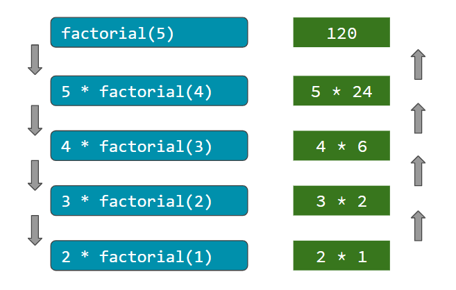

# Recursion in Python

Recursion is a problem solving technique in programming in general. Sometimes, it tends to be concise and elegant solution for a complex problem.

## Overview 
The kind of problems it can be used to solve include problems which are solved in part by itself. The classical example of this would be finding a factorial.

When we are solving a problem in terms of itself, that's when we can use recursion.

Recursion requires a **base case** and a converging call to itself (it means the problem should reduce in size). This is also called **recursive case**. Recursion is widely used in Mathematics, data structures and algorithms. There are pros and cons of this technique.

### Advantages of Recursion

1. It makes it easy to break down the problem into subproblems.
2. The recursive solution tends to be quite elegant.

### Disadvantages of Recursion

1. Recursion may be difficult to understand for complicated problems.
2. They can cause bugs which are hard to find.
3. They can be expensive (in terms of memory consumption and time complexity) depending on the compiler support and the problem size.

## Factorial of a number

Let's see factorial code without recursion first and then see how it gets simplified with recursion. The equation for factorial of a number looks like this.

$$ n! = n * (n - 1)! * (n - 2)! * ... * 1 $$

You can see that in order to calculate factorial of `n`, we can multiply the number with factorial of `n-1`.

**Iterative Example:**

```python
def factorial(n):
    product = 1
    for i in range(1, n + 1):
        product *= i
    return product

print(factorial(5)) # 120
```

Recursive solution is easier to understand if we look at mathematical equation of factorial. In this, we first make sure to handle base case, so that it has eventual termination and then we make sure recursive case is converging towards base case.

**Recursive Example:**

```python
def factorial(n):
    # base case
    if n == 1:
        return 1
    # recursive case
    else:
        return n * factorial(n - 1)
print(factorial(5)) # 120
```

When we actually execute this code, each recursive call add a function call on the stack as shown in the diagram below.



This means if the size of the problem is very large, it can take up lots of stack space and that's when it can result in `StackOverflowError`. Stack is actual memory in your system where temporary variables and functions are stored until the execution of a function. As each function finish execution, it's variables are cleaned up from stack memory.

## Fibonacci numbers using Recursion

Another example of popular recursive case will be to find the fibonacci number. **Fibonacci number** is calculated using the sum of previous two numbers. For example, `0 1 1 2 3 5 8 13` is a fibonacci series where each number is the sum of previous two numbers. It has a base case with 0 and 1 where we return the number itself.

**Example:**

```python
def fibonacci(n):
    # base case
    if n == 0:
        return 0
    elif n == 1:
        return 1
    # recursive case
    else:
        return fibonacci(n - 1) + fibonacci(n - 2)
print(fibonacci(5)) # 5
```