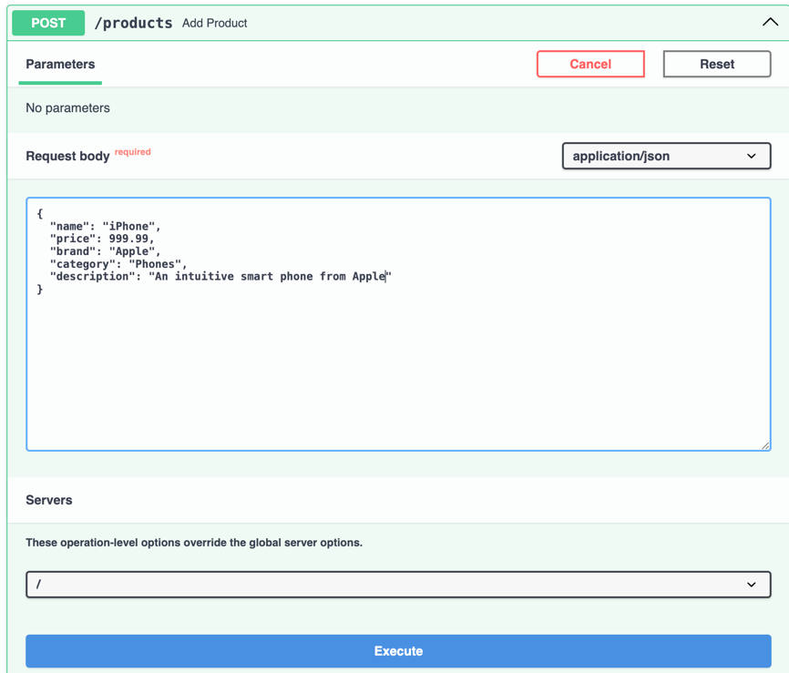

# Defining Request Models

In your API, you may also want to accept data from the client in the request body. This is where you would have to define what data should be available and what constraints each of the fields should adhere to. This is where request models come into play. Request models are used to define the structure of the data that is expected in the request body. This is particularly useful when you want to validate the incoming data and ensure that it matches the expected structure to avoid any future problems.

For example, when you have a `User` model with fields like `name`, `email`, and `password`, you may want to ensure that the `name` field is a string, the `email` field is a valid email address, and the `password` field is a string with a minimum length of 8 characters. You can define a request model that includes these constraints and use it in your API endpoint to validate the incoming data.

FastAPI makes it easy to define request models using Pydantic models. You can define a Pydantic model that includes the fields you want to accept in the request body along with any constraints you want to enforce. Let's see how you can define a request model for the `Product` model. Write below code in a file named `products.py`.

```python
from pydantic import BaseModel
from typing import Optional

products = []

class Product(BaseModel):
    id: Optional[int] = None
    name: str
    price: float
    brand: str
    category: str
    description: str
```

This defines a Pydantic model for `Product` which extends `BaseModel`. The model includes fields like `id`, `name`, `price`, `brand`, `category`, and `description`. The `id` field is optional and is set to `None` by default. This way the client does not need to provide the `id` in their code. The `name` field is a required string, the `price` field is a required float, and the `brand`, `category`, and `description` fields are required strings. The fields are required by default. If you want to make a field optional, you can set a default value for the field.

You can use this model in your API endpoint to accept data from the client in the request body. Let's see how you can use this model in a FastAPI endpoint. Write below code in `main.py` file.

```python
from fastapi import FastAPI

from products import Product, products

app = FastAPI()

@app.get("/products")
async def get_items():
    return products

@app.get("/products/{product_id}")
async def get_item(product_id: int):
    for product in products:
        if product.id == product_id:
            return product

@app.post("/products")
async def add_product(product: Product):
    product.id = len(products) + 1
    products.append(product.dict())
    return product
```

At the moment, our `/products` endpoint would return empty list as we have not added any products yet. You can use tools like Postman or FastAPI `/docs` endpoint to send a POST request to the `/products` endpoint with a JSON payload to add a new product. So, let's add few products.



Add following content to the endpoint to add a new product. Notice that I have not added `id` field explicitly as it is optional and will be auto generated by the server.

```json
{
  "name": "iPhone",
  "price": 999.99,
  "brand": "Apple",
  "category": "Phones",
  "description": "An intuitive smart phone from Apple"
}
```

Now, try getting all products using the `/products` endpoint. You should see the product you just added in the response. Add few more products and test out `/products/{product_id}` endpoint to get a single product based on the `product_id`.

```json
{
  "name": "Pixel 4",
  "price": 799.99,
  "brand": "Google",
  "category": "Phones",
  "description": "A smart phone from Google"
}
```

You can also use the `/products/{product_id}` endpoint to get a single product based on the `product_id`.

Now, test out the `/products` endpoint to post a product without `price` field. 

```json
{
  "name": "Pixel 4",
  "brand": "Google",
  "category": "Phones",
  "description": "A smart phone from Google"
}
```

You should get a response with status code `422 Unprocessable Entity` as the `price` field is required and cannot be empty. The response body includes the error message that the `price` field is required.

```json
{
  "detail": [
    {
      "type": "missing",
      "loc": [
        "body",
        "price"
      ],
      "msg": "Field required",
      "input": {
        "name": "Pixel 4",
        "brand": "Google",
        "category": "Phones",
        "description": "A smart phone from Google"
      }
    }
  ]
}
```

This is the power of Pydantic models in FastAPI. They can provide data validations. You can get lot more specific in terms of your data if you use the `Field` class from Pydantic. You can define constraints like minimum length, maximum length, regex pattern, etc. for each field in your model. 

Let's modify our `Product` model to include some constraints for the fields.

```python
from pydantic import BaseModel, Field
from typing import Optional

class Product(BaseModel):
    id: int = Field(default=len(products) + 1, validate_default=True)
    name: str = Field(min_length=3, max_length=50)
    price: float = Field(ge=0, description="Price must be greater than or equal to 0")
    brand: str = Field(min_length=3, max_length=50)
    category: str = Field(min_length=3, max_length=50)
    description: str = Field(min_length=50, max_length=150)
```

With these changes, restart the server and visit `/products` endpoint. You should see empty list. We are not saving our restults anywhere, it's all in memory. So, after restart the `products` list is empty again. Now, try adding a product with negative value for `price` field. 


You should get a response with status code `422 Unprocessable Entity` as the `price` field must be greater than or equal to 0. The response body includes the error message that the `price` field must be greater than or equal to 0.

```json
{
  "name": "iPhone",
  "price": -999.99,
  "brand": "Apple",
  "category": "Phones",
  "description": "An intuitive smart phone from Apple"
}
```

You would get a response like below.

```json
{
  "detail": [
    {
      "type": "greater_than_equal",
      "loc": [
        "body",
        "price"
      ],
      "msg": "Input should be greater than or equal to 0",
      "input": -999.99,
      "ctx": {
        "ge": 0
      }
    },
    {
      "type": "string_too_short",
      "loc": [
        "body",
        "description"
      ],
      "msg": "String should have at least 50 characters",
      "input": "An intuitive smart phone from Apple",
      "ctx": {
        "min_length": 50
      }
    }
  ]
}
```

Here, we have two errors. One related to `price` being negative and another that the `description` field is less than 50 characters long. This is due to the constraints we defined in our `Product` class.

Notice, that the field `price` needs to be greater than or equal to `0` and the `description` field should have at least `50` characters as shown below. 

```python
    price: float = Field(ge=0, description="Price must be greater than or equal to 0")
    description: str = Field(min_length=50, max_length=150)
```

This way you can be specific in terms of what you expect in the request body when adding a new product in your database. This helps in maintaining the data integrity and consistency in your application. You can define similar constraints for other fields in your model as well. More details on the constraints you can define can be found in the [Pydantic documentation](https://docs.pydantic.dev/latest/concepts/fields/).