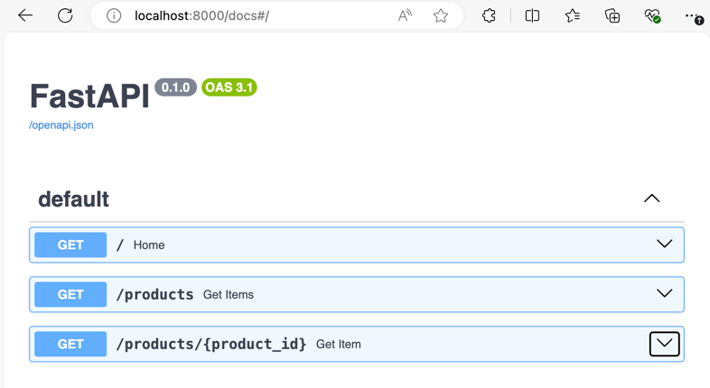
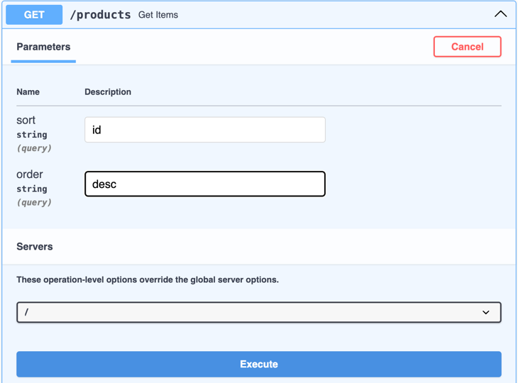
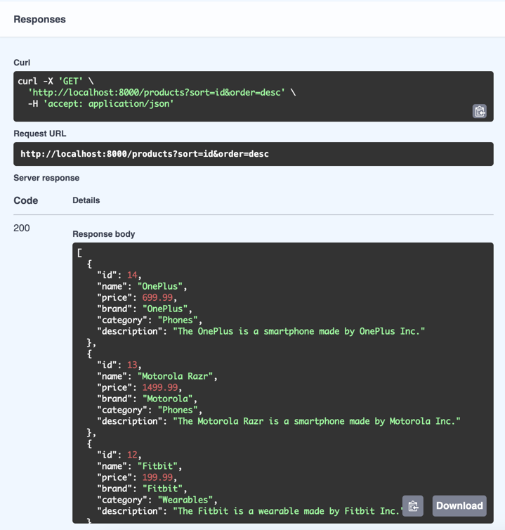

One of the great features of FastAPI is that it comes with built-in interactive API documentation. The swagger UI tool is nicely integrated with FastAPI. This provides a easy to use web interface to experiment and visualize the documentation and test out different endpoints of the API.

Once you run your application, you can access the API documentation at url `http://localhost:8000/docs`. This API documentation is auto-generated using the OpenAPI schema. The OpenAPI schema is a standard for documenting APIs and follows OpenAPI specification. FastAPI automatically generates the OpenAPI schema for your API based on the type hints in your code.

## Testing `/products` endpoint

The Swagger UI provides a nice interface to test the API. You can expand each API endpoint by clicking on the down arrow on the right hand side. Click on down arrrow next to `/products` endpoint which will expand the endpoint form and provide you with options for inserting path parameters and query parameters. You can click on the `Try it out` button to test the API. Once you click on it, you will see options for inputting values for `sort` and `order` query parameters. You can input values for these parameters and click on `Execute` button to test the API.

In each endpoint, you can also see which fields are query parameters and which fields are path parameters in the parenthesis next to the field name. You can see that `sort` and `order` both fields are of type `string` and are query parameters in the below image.

You will see reponse as a JSON object in the `Response body` section. You can also see the curl command to test the API from the command line if you wish to do so.

## Testing `/prdoucts/{product_id}` endpoint

Similarly, you can test the `/products/{product_id}` endpoint by expanding the endpoint form and clicking on `Try it out` button. You can input a value for `product_id` path parameter and click on `Execute` button to test the API.

OpenAPI and Swagger UI is great for testing and debugging your API endpoints. This can be especially useful when you want to test `POST`, `PATCH` or `DELETE` endpoints because those are difficult to test using a browser as we need to pass request body or path parameters for those.

